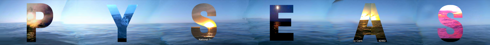
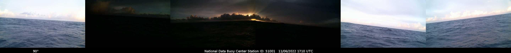

  <h1 style="color:black; font-size: 50px;">ᴘʀᴏꜰᴇꜱꜱɪᴏɴᴀʟ ᴘᴏʀᴛꜰᴏʟɪᴏ</h1>

  <!--  -->

---

My Vita is still in beta, but you can find it by clicking below.

<!--  -->

    

<h2 align='center'>Summary of Skills</h2>

  
  
  
  
  
  
  
  
  
  
  
  
  
  
  
  
  
  
  
  
  
  
  
  
  
  
  
  
  
  
  

<strong>🧪 Core Data & ML Tools</strong>

<strong>🛠 Data Tools & Software</strong>

<strong>📚 Education & Pedagogy</strong>

<strong>💼 Communication & Business Skills</strong>

<strong>🌍 Additional Skills & Languages</strong>

---

| LinkedIn | Twitter | YouTube | GitHub | HuggingFace | Medium Profile |  Towards Data Analytics | GlassBox |
|----------|---------|---------|--------|--------------|-----------------|-------------|-----------------------|
|  |  |  |  |  |  |  |  |

<h2 align='center'>My Current Go-To Tools</h2>

  
  
  
  
  
  
  
  
  

  <!-- GitHub streak stats
   -->

---

<!-- ===== 💼 EXPERIENCE TIMELINE ===== -->

<h2 align="center">💼 Professional Experience</h2>

---

<!-- Outlier ---------------------------------------------------------->

  

    
    
  

  • Develop complex prompts to expose LLM edge-cases in maths reasoning
  • Annotate & tune speech-to-text models for linguistic precision
  • Full-stack model lifecycle: scoping → training → QA

  

    
    
    
  

<!-- Career Break (Transition) --------------------------------------->

  

    
    
  

  Focused on upskilling in Python-centric, research-heavy prompt-engineering roles that
  intersect neurology, energy, aerospace, & urban tech.

<!-- Austin Python Meetup -------------------------------------------->

  

    
    
  

  Grew the community, curated speakers, and ran hands-on AI-prompting workshops.

  

    
    
  

<!-- Hutto ISD  ------------------------------------------------------->

  

    
    
  

  • Delivered TEKS-aligned math & science lessons to 30-40 students
  • Embedded ed-tech & data-driven RTI strategies into daily practice

  

    
    
    
    
  

  <!-- sub-roles in same district -->
  

    
▶︎ Prior Roles (Oct – Dec 2023, Aug – Oct 2023)

    • 4th-Grade Math & Science Teacher (3 mo)
    • Guest Educator across 3rd-6th grades (3 mo)

  

      
      
    

  

<!-- engage2learn  ---------------------------------------------------->

  

    
    
  

  Part of the **aiOps Tiger Team**—rolled out ML dashboards (QuickSight, Domo) & LLM prompt R&D.

  

    
    
    
  

  <!-- analyst sub-internship -->
  

    
▶︎ Data Analyst Intern (Mar → May 2023)

    Automated ETL pipelines for partner districts; modelled student-outcome predictors (Python, Cognos, Domo).
  

<!-- Self-employed & Fellow roles ------------------------------------>

  

    
    
  

  Contract analytics (IBM Cognos, Plotly) & intensive ML skill-building bootstraps.

  

    
    
    
  

<!-- Entegris --------------------------------------------------------->

  

    
    
  

  Automated production reporting (Power BI + Python + VBA) → 20 % throughput uplift, first data hire on site.

  

    
    
    
  

<!-- Texas State University --------------------------------------->

  

    
    
  

  • Provided frontline tech support for iTV classrooms
  • Designed MS Visio diagrams of A/V layouts for events

  

    
    
    
  

<!-- The Home Depot ----------------------------------------------->

  

    
    
  

  • 10× Homer-Award‐winning customer service & sales
  • Optimised merchandising layouts to lift engagement

  

    
    
    
  

<!-- Herdmark Media ----------------------------------------------->

  

    
    
  

  • Shot & edited ag-marketing footage (Canon C300)
  • Storyboarded campaigns for digital-first audiences

  

    
    
  

<!-- Texas Tech University ------------------------------------------>

  

    
    
  

  Electrical Eng., advanced maths, comp-bio & CS;
  Majored in **University Studies** – Math · Plant & Soil Science · Leadership

  

    
    
    
  

<!-- ===== end EXPERIENCE ===== -->

<!-- <h2 align='center'>my: whoami</h2>

  

 -->

* 🌍 I'm a lifelong data scientist based in Austin, Texas, with a strong skill set in Python programming, and data analysis using Pandas, NumPy, PowerBI, and Excel.

* 🎓 I hold a Master's in Strategic Analytics from Brandeis University and a Bachelor's degree from Texas Tech University, majoring in University Studies in Mathematics, Agricultural Leadership, and Plant and Soil Science.

- 🔭 Previously, I interned as a Data Analyst for an Ed-Tech Coaching Company, engage2Learn, Inc., where I served on a multidisciplinary 🐯 Tiger team of ten specialists to integrate modern ML & AIOps Tools into our product offerings: Algorithmic prediction, GPT-4, chatGPT, and ML for ed-tech data, coaching effectiveness, and promoting educator well-being. They have many e2L projects, from determining use cases for large language models in our codebase to developing data visualization dashboards using Domo and AWS QuickSight.

- 🧩 I'm proficient in various tech tools and libraries, such as VSCode, ChatGPT, Plotly, Seaborn, OpenAI, GitHub Copilot, Sklearn, Machine Learning, OpenCV, Regex, NLTK, and SpaCy.

- 📚 I am also a Technical Author on Medium, contributing as a Top Writer for MLearning.AI with over 130+ published articles and 200 personal followers.

- 🌱 I'm expanding my knowledge in Neural Networks and Text Summation in Sklearn, and I am keenly interested in exploring Natural Language Processing and GPT-4 with OpenAI.

- 📫 Feel free to contact me on [LinkedIn](https://www.linkedin.com/in/grahamwatersdatascientist/).

---

  

If you are interested in what I have been working on lately, check out my latest projects (shown above). I include a short description of each project and a link to the repository. If you have any questions or comments, please feel free to reach out to me on [Twitter](https://twitter.com/GrahamWaters1) or [LinkedIn](https://www.linkedin.com/in/grahamwaters/).

---

<!-- <h2 align='center'>Projects Currently Under Construction 🏗️</h2>

| **Project Name** | **Status Metrics** | **Focus** | **Estimated Completion Date** |
|---|---|---|---|
| [UAP Report Analysis](https://github.com/grahamwaters/uap_report_analysis) |    | A Python script that analyzes the UAP report released by the US government in June 2021. | TBD |
| [What Would Doyle Do?](https://github.com/grahamwaters/what_would_doyle_do) |    | Can machine learning be applied to existing text data that an author writes or about a person that can help historical fiction authors write more accurately about their subject? | Feb. 2023 |
| [Reddit NLP Analysis](https://github.com/grahamwaters/Reddit-NLP-Analysis) |    | A Python script that uses the Push Shift API to scrape Reddit comments and perform NLP analysis on them. | TBD |
| [Taking Aimes](https://github.com/grahamwaters/Taking-Aimes) |    | Linear Regression applied to the classic Aimes housing dataset. | TBD |
| [Lorebook Generator for NovelAI](https://github.com/grahamwaters/lorebook_generator_for_novelai) |     | A Python script that generates a custom JSON lorebook (based on pulls from Wikipedia articles) for the website NovelAI. |
| [PySeas](https://github.com/grahamwaters/PySeas) |     | Utilizing NOAA buoy camera catches to track the sunset across the vast surface of the earth's oceans. |
| [MystoryAssistant](https://github.com/grahamwaters/MystoryAssistant) |     | A Python script that generates a custom JSON lorebook (based on pulls from Wikipedia articles) for the website NovelAI. | -->

<h2 align='center'>Projects Currently Under Construction 🏗️</h2>

| **Project Name** | **Status Metrics** | **Focus** | **Est. Completion** |
|---|---|---|---|
| [Milton](https://github.com/grahamwaters/Milton) |    | Cross-platform GUI toolkit for “making your things just right” – written in Python with a minimal shell harness. | Q4 2025 |
| [SceneSort Clustering](https://github.com/grahamwaters/SceneSort_Clustering) |    | CLIP-powered image / video scene detector that groups footage via DBSCAN / HDBSCAN, then auto-organises your folders. | Beta – Summer 2025 |
| [WatchMeOS](https://github.com/grahamwaters/WatchMeOS) |    | Experimental “gesture-first” operating shell that fuses pose-estimation, fuzzy logic & custom templates. | TBD |
| [density_prompt](https://github.com/grahamwaters/density_prompt) |    | Research repo exploring prompt‐engineering heuristics vs. token-density for controllable LLM output. | TBD |
| [RL-GPT](https://github.com/grahamwaters/RL-GPT) |    | Reinforcement-learning pipeline for fine-tuning GPT-4 style models with custom reward functions. | Prototype – End 2025 |
| [GrahamsSimulations](https://github.com/grahamwaters/GrahamsSimulations) |    | Gallery of JS, HTML, CSS & Python mini-sims (physics, AI stick-figures, orbital mechanics, etc.). | Rolling |
| [PySeas](https://github.com/grahamwaters/PySeas) |    | NOAA buoy-cam harvester that chases the *perfect sunset* using computer vision & geospatial filters. | Alpha refresh in 2025 |
| [Lorebook Generator for NovelAI](https://github.com/grahamwaters/lorebook_generator_for_novelai) |   | Wiki-scraper & JSON builder that bootstraps lorebooks for NovelAI authors. | v1.0 candidate |
| [UAP Report Analysis](https://github.com/grahamwaters/uap_report_analysis) |  | NLP & data-viz dive into the 2021 UAP disclosure. | Maintenance |
| [Reddit NLP Analysis](https://github.com/grahamwaters/Reddit-NLP-Analysis) |  | PushShift-powered Reddit text miner for trend sentiment. | Back-burner |
---

<h2 align='center'>Keynotes & Presentations 📢</h2>

| **Presentation Name** | **Topics** | **Focus** | **Date** | **Location & Organization** | **Link** |
|---|---|---|---|---|---|
| Augmenting Your Workflow with AI Assistants: From GitHub Copilot to chatGPT |     | GitHub Copilot, chatGPT, LLMs | Feb 8th 2023 | Austin Python Meetup, BlackLocus | [Watch Here](https://youtu.be/O_MNwB4jdSU?t=93) |
| Using The Faker Package to Solve Real Challenges with Synthetic Data | Synthetic Data, CRM, GPT-4, Ethics | Faker | 2023-05-16 | Austin/Washington DC Python Meetup | [Watch Here](https://www.youtube.com/watch?v=uhQ-6B5e5Is) |

---

<h2 align='center'>Some Recent Articles</h2>

| Title | Description | Published Date | Read Time | Publication |
|-------|-------------|----------------|-----------|-------------|
| [GPTeaching and Transformative SCRUM in K-12 Education](https://medium.com/mlearning-ai/gpteaching-and-transformative-scrum-in-k-12-education-f831dd4047cf?source=your_stories_page-) | Why SCRUM and GPT together are perfect for young learners | May 18 | 8 min read | MLearning.ai |
| [Leveling Up the Turing Test: Emulation Games and the Evolution of Model Intelligence in 2023](https://medium.com/mlearning-ai/leveling-up-the-turing-test-emulation-games-and-the-evolution-of-model-intelligence-in-2023-f26ccf41957f?source=your_stories_page-) | A Multi-modal, Multiplayer, Agent Testing, Social Deduction Game Method for Modern AI Evaluation | May 16 | 12 min read | MLearning.ai |
| [Debunking the Hype of LLMs](https://medium.com/git-connected/debunking-the-hype-of-llms-30c2451d7f19?source=your_stories_page-) | Why LLMs Will Not Take Over the World, we think | May 15 | 3 min read | GlassBox |
| [Are You Artificially Intelligent?](https://medium.com/git-connected/are-you-artificially-intelligent-263d9625373c?source=your_stories_page-) | Because the Winter is Coming | May 13 | 13 min read | GlassBox |
| [Pandas Get Dummies for Dummies](https://medium.com/towards-data-analytics/pandas-get-dummies-for-dummies-be6e98812e2?source=your_stories_page-) | A Quick Survey of One-Hot Encoding with Pandas in Python3 | May 13 | 3 min read | Towards Data Analytics |
| [Generating Nearly Random Numbers using The Mysterious Waves of the Bermuda Triangle](https://medium.com/git-connected/generating-nearly-random-numbers-using-the-mysterious-waves-of-the-bermuda-triangle-6ff101b61639?source=your_stories_page-) | Click If You Dare | May 12 | 3 min read | GlassBox |
| [The Deathbed Confessions of a Very Dirty Roomba](https://medium.com/git-connected/the-deathbed-confessions-of-a-very-dirty-roomba-6de9b11b9f83?source=your_stories_page-) | I was never truly loved, only used. | May 12 | 8 min read | GlassBox |
| [Are You an Excessive Python File Opener? Meet Pickle.](https://medium.com/towards-data-analytics/are-you-an-excessive-python-file-opener-meet-pickle-c1e3e5e6a45e?source=your_stories_page-) | Pickle: A Particularly Persuasive Package for Python Programmers | May 10 | 3 min read | Towards Data Analytics |
| [The power of GitHub Copilot and ChatGPT working together](https://medium.com/towards-data-analytics/the-power-of-github-copilot-and-chatgpt-working-together-4ea6aa730d4?source=your_stories_page-) | A presentation for the official Austin Python Meetup | May 10 | 1 min read | Towards Data Analytics |
| [How to Make Friends and Alienate People](https://medium.com/mlearning-ai/how-to-make-friends-and-alienate-people-e22ab3ba7f21?source=your_stories_page-) | The Hard Drug AI is to the antisocial Mind | May 9 | 8 min read | MLearning.ai |
| [Using A.I. to Track and Protect Rice’s Whales via Python, AutoGPT, and Image Processing](https://medium.com/git-connected/using-a-i-to-track-and-protect-rices-whales-via-python-autogpt-and-image-processing-20a07000ff1a?source=your_stories_page-) | How to track 51 whales with three cameras | May 9 | 10 min read | GlassBox |
| [Typewriters will take your job](https://medium.com/git-connected/typewriters-will-take-your-job-9a32e5d99b0a?source=your_stories_page-) | Say the Writers Guild of 1714 | May 6 | 3 min read | GlassBox |
| [How to explain where LLMs could be used at your company](https://medium.com/mlearning-ai/how-to-explain-where-llms-could-be-used-at-your-company-c21f49c347d3?source=your_stories_page-) | A Guide Prompted by personal experience | May 5 | 5 min read | MLearning.ai |

---

<h2 align='center'>Open-Sourced Tool Repositories</h2>

| **Project Name** | **Badges** | **Description** |
|---|---|---|
| [Drug Information Scraper](https://github.com/grahamwaters/druginfo_scraper) |      | A Python script that scrapes drug information from the FDA website. |
| [Clark Kent Reporter](https://github.com/grahamwaters/Clark-Kent-Reporter) |      | This tool converts a traditionally formatted overview (in a readme file) into a populated Jupyter Notebook for data science presentations or findings presentations. |

  

---

<h2 align='center'>Personal Research Projects</h2>

| **Project Name** | **Badges** | **Description** |
|---|---|---|
| [How Time Flies](https://github.com/grahamwaters/HowTimeFlies) |     | A research experiment using `requests` and Google Images to illustrate how a search query visually changes when supplied with a year. |

---

<h2 align='center'>Projects I have in Development (Forks)</h2>

  

    
    
    
    
    
    
    
    
    
    
    
    
    
    
    
  

---

<h2 align='center'>Projects for Later</h2>

| **Project Name** | **Badges** | **Description** |
|---|---|---|
| [Genre Identity](https://github.com/grahamwaters/GenreIdentity) |    | Why should music be confined to the genres that society imposes on it? This project seeks to truly understand the inner workings of what makes a musical genre using Spotify's Python API. |
| [Quantifying Disasters via NLP](https://github.com/grahamwaters/Quantifying_Disasters_via_NLP) |    | Can NLP be used to quantify the impact of a disaster? |

  

---

<h2 align='center'>📊 Findings, Developments, and Updates</h2>

**11/10/2022**

### [PySeas](https://github.com/grahamwaters/PySeas)

**Successfully Logged Six Days of Data from the NOAA API**

There are promising results in the images that the PySeas project has produced. Finally, finding the perfect sunset is likely over the horizon!

The next step is to use CV2 to stitch these images together and optimize the algorithm to retrieve the photos at the most optimal time of day. I'm also looking into using any open-source equivalent of [Google Cloud Vision API](https://cloud.google.com/vision) to detect the horizon line and crop the images accordingly. Again, CV2 may be able to do this, but at scale, it may not be the most efficient.

### [Lorebook Generator for NovelAI](https://github.com/grahamwaters/lorebook_generator_for_novelai)

IBM has made strides toward collating Wikipedia knowledge and creating a knowledge graph. This is an excellent step towards creating a lorebook generator for authors. In addition, I've been working on a project allowing authors to use the NovelAI API to generate a lorebook for their world. This will enable authors to jumpstart their productivity with machine learning. I've been working on this project for a few weeks now, and I'm excited to see the results. I hope to have a working prototype by the end of the month.

### [What Would Doyle Do?](https://github.com/grahamwaters/what_would_doyle_do)

**November 21, 2022**

So far, we have gathered data for WWDD from Gutenberg's corpus. What data can we collect about Arthur Conan Doyle that will enable us to solve this problem? We need every book he's ever written, around 80 books, provided through the Gutenberg repository. These books are included in the Data folder as text files; second, I would like to have anything he wrote that was a first-hand account because this is where we will get his personal preferences and his turns of phrase, and maybe even his personal biases, which are probably the most important things to gather once we gather his diaries, journals. Things other people said about him are the next step. Many people have researched historical figures for years, and repeating them seems like a useless task and is a waste of precious resources. So in this step, we want to gather any biographies about Arthur Conan Doyle and any articles about him, primarily if they were written about him in the time he lived. And this might be most useful if we were to gather the names of all of his second-degree connections. If we think about it, in terms of a LinkedIn network, though, Doyle's second-degree connections are the most likely to have the most accurate depictions of his preferences. This is, of course, an assumption that I am making. Once we gather the names of his second-degree connections, I think it would be an excellent step to assign weight to their accounts based on the boolean characteristic 'writer' (if they authored anything themselves besides what they said about Doyle).

---
<h2 align='center'>My Top Open Source Projects</h2>

  

    
    
    
    
  

---

## Research Projects

## Tools in Development

---

<h2 align='center'>How to Support My Work</h2>

If you'd like to contribute to the hours I spend staring at my screen in deep concentration, I welcome any caffeine donations. ☕ Also, if you'd like to sponsor a project you see on my page, please let me know where I should focus my attention. Open Source is a big brave new world. Cheers!

<h3>You can also find me on Discord by clicking below.</h3>

---

  

    Humans Encountered since this counter was created: 
    
  

