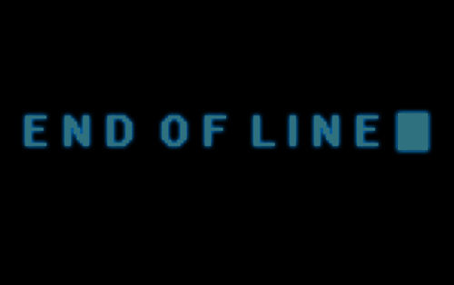

<!-- <h1>

<h1 style= "color:yellow; font-size: 50px; text-align: center;">
ᴘʀᴏꜰᴇꜱꜱɪᴏɴᴀʟ ᴘᴏʀᴛꜰᴏʟɪᴏ

</h1> -->

<!-- https://www.google.com/url?sa=i&url=https%3A%2F%2Fwww.unit9.com%2Fproject%2Ffalling-water-center-dream-research%2F&psig=AOvVaw1io37EI0DpNTFb44f1nimy&ust=1668212139465000&source=images&cd=vfe&ved=0CA8QjRxqFwoTCIj5qtLspPsCFQAAAAAdAAAAABAH -->

  <!-- Typing SVG by DenverCoder1 - https://github.com/DenverCoder1/readme-typing-svg -->
  

---

<!-- <h1>~$ Who Am I?</h1> -->

  <!-- Typing SVG by DenverCoder1 - https://github.com/DenverCoder1/readme-typing-svg -->
  

*   🌍  I'm based in Austin, Texas

* I am a Texas Tech (Undergrad) Alumni, and a Brandeis University (Graduate) Alumni.

*  🎓  My Master's is in Strategic Analytics.

- 🔭 I’m currently working on [NovelAI - Lorebook Generation](https://github.com/grahamwaters/lorebook_generator_for_novelai.git) for authors that are jumpstarting their productivity with machine learning.

- 🌱 I’m currently learning Neural Networks and Text Summation in Sklearn. I'd like to get into NLP and GPT-3 with OpenAI as well.

- ❓ Ask me about anything you'd like to know about Python or its related technologies, I'd love to chat.

- 📫 How to reach me: LinkedIn, Discord, or Email.

- ⚡ Fun fact: I am a huge fan of SETI, and am fascinated by the Hum and everything about the James Webb Space Telescope.
- Finally, If I had to be a movie genre, I'd be SciPy.

<!--  -->

<!-- copy the structure of the block above with the public repositories for user grahamwaters on GitHub -->
<!-- make h3 headers centered  -->

<h1 align='Center'
> Table of Contents </h1>

- [Progress Report](#progress-report)
  - [PySeas](#pyseas)
  - [Lorebook Generator for NovelAI](#lorebook-generator-for-novelai)
- [What is in my Tool Box?](#what-is-in-my-tool-box)
- [Most Recent Projects](#most-recent-projects)
- [Projects that are Under Construction 🏗️](#projects-that-are-under-construction-️)
- [Tools and Simple Projects](#tools-and-simple-projects)
- [My Backburner Projects](#my-backburner-projects)
    - [Blatant Self-Promotion](#blatant-self-promotion)

# Progress Report
**11/10/2022**

## [PySeas](https://github.com/grahamwaters/PySeas)

Successfully Logged Six Days of Data from the NOAA API
There are promising results in the images that the PySeas project has produced. It seems highly likely that finding the perfect sunset is just over the horizon!

Using CV2 to stitch these images together and optimizing the algorithm to retrieve the images at the most optimal time of day is the next step. I'm also looking into using any open source equivilant of [Google Cloud Vision API](https://cloud.google.com/vision) to detect the horizon line and crop the images accordingly. CV2 may be able to do this, but at scale it may not be the most efficient.

## [Lorebook Generator for NovelAI](https://github.com/grahamwaters/lorebook_generator_for_novelai)

<!-- add badges -->

IBM has made strides towards collating wikipedia knowledge and creating a knowledge graph. This is a great step towards the creation of a lorebook generator for authors. I've been working on a project that will allow authors to use the NovelAI API to generate a lorebook for their world. This will allow authors to jumpstart their productivity with machine learning. I've been working on this project for a few weeks now, and I'm excited to see the results. I'm hoping to have a working prototype by the end of the month.

---

# What is in my Tool Box?

<h1 align='Center' style= "color: #FFD43B">
</h1>

| Currently Learning | General Topics |
| --- | --- |
| | Deep learning and Neural Networks.|

| My Favorite Tools| Tools I've Used |
| --- | --- |
|   <a href="https://pandas.pydata.org/" target="_blank">  |   |

| |  |
| --- | --- |
|  |  |

<h1>
<h1 align='center'>Languages and Frameworks</h4>

    
    
    
    
    
    
    
    
    

    
    
    
    
    
    
    
    

</h1>

<!-- create a new div with commits graph -->

 

  <h1>My Top Open Source Projects</h1>

  <!-- Typing SVG by DenverCoder1 - https://github.com/DenverCoder1/readme-typing-svg -->
  

  
  
  
  
  
  
  
  
  

<!-- profile views count -->

    

<!-- 
 -->

If you are interested in what I have been working on lately then check out my latest projects (shown below). I include a short description of each project and a link to the repository. If you have any questions or comments, please feel free to reach out to me on [Twitter](https://twitter.com/GrahamWaters1) or [LinkedIn](https://www.linkedin.com/in/grahamwaters/).

# Most Recent Projects

<!-- align="center">Projects that I Love
 -->
<!-- make title "Projects I Love" and center it -->

<!-- Projects to include in the table below:
1. Lorebook generator
2. PySeas
3. Taking Aimes
4. Reddit NLP Analysis
5. How Time Flies (https://github.com/grahamwaters/HowTimeFlies)
 -->
| **Project Name** | **Badges** | **Description** |
|---|---|---|
[Lorebook Generator for NovelAI](https://github.com/grahamwaters/lorebook_generator_for_novelai) |     | A Python script that generates a custom json lorebook (based on pulls from wikipedia artiles) for the website NovelAI. |
[PySeas](https://github.com/grahamwaters/PySeas) |    | A Python package that provides a simple interface to the NOAA CO-OPS API. |
[How Time Flies](https://github.com/grahamwaters/HowTimeFlies) |    | A research experiment using `requests` and google images to illustrate how a seearch query visually changes when supplied with a year. |

# Projects that are Under Construction 🏗️

| **Project Name** | **Status Metrics** | **Focus** | **Estimated Completion Date** |
|---|---|---|---|
| [What would Doyle do?](https://github.com/grahamwaters/what_would_doyle_do) |     | Can machine learning be applied to existing text data that an author writes or about a person that can help historical fiction authors write more accurately about their subject? | Dec. 2022 |
[Reddit NLP Analysis](https://github.com/grahamwaters/Reddit-NLP-Analysis) |    | A Python script that uses the Push Shift API to scrape Reddit comments and perform NLP analysis on them. | Nov. 2022 |
[Taking Aimes](https://github.com/grahamwaters/Taking-Aimes) |    | Linear Regression applied to the classic Aimes housing dataset. | Nov. 2022 |

# Tools and Simple Projects
| **Project Name** | **Badges** | **Description** |
|---|---|---|
| [Drug Information Scraper](https://github.com/grahamwaters/druginfo_scraper) |     | A Python script that scrapes drug information from the FDA website. |

<!-- end of table -->

<!-- Projects that may be fleshed out later on but are in their infancy as of this portfolio. -->
<!-- | War of the Words | DA | Text Mining | DA_TextMining_projects.ipynb | [link](https://github.com/grahamwaters/warofthewords) | -->
<!-- | A Butler for Authors | DA | Text Mining | DA_TextMining_projects.ipynb | [link](https://github.com/grahamwaters/a_butler_for_authors) | -->

</td></tr></table>
 
 

----

<h1 align="center">Projects I have in dev (forks)</h2>

  
  
  
  
  
  
  
  
  
  
  
  
  
  
  

# My Backburner Projects

  
  

### Blatant Self-Promotion

If you'd like to contribute to the hours that I spend staring at my screen in deep concentration I welcome any and all caffeine donations. ☕ Also, if you'd like to sponsor a project that you see on my page please reach out and let me know where I should focus my attention. Open Source is a big brave new world. Cheers!

<h3> You can also find me on Discord by clicking below.</h3>

<!-- Thanks to https://profilinator.rishav.dev/ for the template -->
<!-- 
Generated using <a href="https://profilinator.rishav.dev/" target="_blank">Github Profilinator</a>
 -->

<!-- tron blue is what color? -->
<!-- tron_blue = "#1F222E" -->
<!-- # the color for yellow (python yellow) is #FFD43B -->
<!-- The color for python blue is #3776AB -->

  <!-- Typing SVG by DenverCoder1 - https://github.com/DenverCoder1/readme-typing-svg -->
  <a href="https://github.com/DenverCoder1/readme-typing-svg">+Loading;Data+Analysis;Performing+EDA;Data+Cleaning;More+Data+Cleaning;...more+data+cleaning;automating+data+cleaning;finding+joy!;Outlier+Detection;Feature+Engineering;Feature+Selection;Modeling;Model+Evaluation;Boosting+with+AdaBoost;Watching+for+UAEs;Analyzing+Gutenberg;Writing+Historical+Fiction;Creating+Art+with+GPT-3;Looking+for+ways+to+apply+ML;to+everything...;&font=menlo%20Code&center=true&width=440&height=45&color=FFD43B&vCenter=true&size=22&pause=500" /></a>

<!-- create one more of these with 3776AB  -->

<a href="https://github.com/DenverCoder1/readme-typing-svg">+Loading;Data+Analysis;Performing+EDA;Data+Cleaning;More+Data+Cleaning;...more+data+cleaning;automating+data+cleaning;finding+joy!;Outlier+Detection;Feature+Engineering;Feature+Selection;Modeling;Model+Evaluation;Boosting+with+AdaBoost;Watching+for+UAEs;Analyzing+Gutenberg;NLP;Named Entity Recognition;SpaCy;SciPy;Writing+Historical+Fiction;Creating+Art+with+GPT-3;Looking+for+ways+to+apply+ML;to+everything...;&font=menlo%20Code&center=true&width=440&height=45&color=3776AB&vCenter=true&size=22&pause=100" /></a>

<!-- profile views count -->

    

<!-- the block above -->
 

