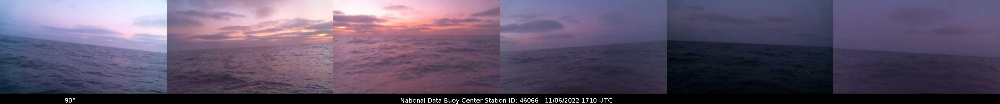

<!-- <h1>

<h1 style= "color:yellow; font-size: 50px; text-align: center;">
ᴘʀᴏꜰᴇꜱꜱɪᴏɴᴀʟ ᴘᴏʀᴛꜰᴏʟɪᴏ

</h1> -->

<!-- [My Snapshot](snapshot.md) -->

<!-- https://www.google.com/url?sa=i&url=https%3A%2F%2Fwww.unit9.com%2Fproject%2Ffalling-water-center-dream-research%2F&psig=AOvVaw1io37EI0DpNTFb44f1nimy&ust=1668212139465000&source=images&cd=vfe&ved=0CA8QjRxqFwoTCIj5qtLspPsCFQAAAAAdAAAAABAH -->

<!--  -->

---

## Hi There! 👋 welcome to my GitHub!

---

**Some Quick Facts About Me:**
* 🌍  I'm based in Austin, Texas.

* Texas Tech (Undergrad) Alumni and Brandeis University (Graduate) Alumni.

*  🎓  My Master's is in Strategic Analytics.

- 🔭 I’m currently working on several projects that are listed below, mostly brushing up on my machine learning skills and how they can be applied to various problem scenarios.

- 🌱 I'm currently learning Neural Networks and Text Summation in Sklearn. I'd also like to get into NLP and GPT-3 with OpenAI.

- 📫

- ⚡ Fun fact: I am a massive fan of SETI and am fascinated by the Hum and everything about the James Webb Space Telescope.

- Finally, If I had to be a movie genre, I'd be SciPy.

---

    

<h1 align='center'>Languages and Frameworks
</h1>

    
    
    
    
    
    
    
    
    

    
    
    
    
    
    
    
    

</h1>

<h1 align='Center'
> What's Here </h1>

---

- [Research Projects](#research-projects)
- [Tools in Development](#tools-in-development)
- [Most Recent Projects](#most-recent-projects)
- [Projects Currently Under Construction 🏗️](#projects-currently-under-construction-️)
- [Upcoming Presentations 📢](#upcoming-presentations-)
- [Open-Sourced Tool Repositories](#open-sourced-tool-repositories)
- [My Backburner Projects](#my-backburner-projects)
- [Progress Report](#progress-report)
  - [PySeas](#pyseas)
  - [Lorebook Generator for NovelAI](#lorebook-generator-for-novelai)
  - [What Would Doyle Do?](#what-would-doyle-do)
  - [November 21, 2022](#november-21-2022)
- [How to Support My Work](#how-to-support-my-work)

---

<h1> My Favorite Tools </h1>
    <a href="https://pandas.pydata.org/" target="_blank"> 

 

  

---

<h1>My Top Open Source Projects</h1>

  
  

# Research Projects
  
  

# Tools in Development

<!-- profile views count -->

    

<!-- 
 -->

If you are interested in what I have been working on lately, check out my latest projects (shown below). I include a short description of each project and a link to the repository. If you have any questions or comments, please feel free to reach out to me on [Twitter](https://twitter.com/GrahamWaters1) or [LinkedIn](https://www.linkedin.com/in/grahamwaters/).

# Most Recent Projects

<!-- align="center">Projects that I Love
 -->
<!-- make the title "Projects I Love" and center it -->

<!-- Projects to include in the table below:
1. Lorebook generator
2. PySeas
3. Taking Aimes
4. Reddit NLP Analysis
5. How Time Flies (https://github.com/grahamwaters/HowTimeFlies)
 -->
| **Project Name** | **Badges** | **Description** |
|---|---|---|
[Lorebook Generator for NovelAI](https://github.com/grahamwaters/lorebook_generator_for_novelai) |      | A Python script that generates a custom JSON lorebook (based on pulls from Wikipedia articles) for the website NovelAI. |
[PySeas](https://github.com/grahamwaters/PySeas) |     | Utilizing NOAA buoy camera catches to track the sunset across the vast surface of the earth's oceans. |
[How Time Flies](https://github.com/grahamwaters/HowTimeFlies) |     | A research experiment using `requests` and google images to illustrate how a search query visually changes when supplied with a year. |

# Projects Currently Under Construction 🏗️

| **Project Name** | **Status Metrics** | **Focus** | **Estimated Completion Date** |
|---|---|---|---|
| [What would Doyle do?](https://github.com/grahamwaters/what_would_doyle_do) |     | Can machine learning be applied to existing text data that an author writes or about a person that can help historical fiction authors write more accurately about their subject? | Dec. 2022 |
[Reddit NLP Analysis](https://github.com/grahamwaters/Reddit-NLP-Analysis) |    | A Python script that uses the Push Shift API to scrape Reddit comments and perform NLP analysis on them. | Dec. 2022 |
[Taking Aimes](https://github.com/grahamwaters/Taking-Aimes) |    | Linear Regression applied to the classic Aimes housing dataset. | Dec. 2022 |
| [Genre Identity](https://github.com/grahamwaters/GenreIdentity) |     | Why should music be confined to the genres that society imposes on it? This project seeks to truly understand the inner workings of what makes a musical genre using Spotify's Python API.| Dec. 2022|
| [Quantifying Disasters via NLP](https://github.com/grahamwaters/Quantifying_Disasters_via_NLP) |     | Can NLP be used to quantify the impact of a disaster? | Jan. 2023 |

# Upcoming Presentations 📢

| **Presentation Name** | **Topics** | **Focus** | **Date Estimated** | **Location** |
|---|---|---|---|---|
| How we can use AI Assistants without surrendering our autonomy in the age of AI-enhanced programming and authorship. |    | GitHub Copilot, NovelAI's Snek and responsible usage of AI. | Feb/March 2023 | Austin Python Meetup (Virtual) |

# Open-Sourced Tool Repositories
| **Project Name** | **Badges** | **Description** |
|---|---|---|
| [Drug Information Scraper](https://github.com/grahamwaters/druginfo_scraper) |     | A Python script that scrapes drug information from the FDA website. |
| [Clark Kent Reporter](https://github.com/grahamwaters/Clark-Kent-Reporter) |      |This tool converts a traditionally formatted overview (in a readme file) into a populated Jupyter Notebook for data science presentations or findings presentations. |

<!-- end of table -->

<!-- Projects that may be fleshed out later on but are in their infancy as of this portfolio. -->
<!-- | War of the Words | DA | Text Mining | DA_TextMining_projects.ipynb | [link](https://github.com/grahamwaters/warofthewords) | -->
<!-- | A Butler for Authors | DA | Text Mining | DA_TextMining_projects.ipynb | [link](https://github.com/grahamwaters/a_butler_for_authors) | -->

</td></tr></table>
 
 

----

<h1 align="center">Projects I have in dev (forks)</h2>

  
  
  
  
  
  
  
  
  
  
  
  
  
  
  

# My Backburner Projects

  <!--  -->
  

# Progress Report
**11/10/2022**

## [PySeas](https://github.com/grahamwaters/PySeas)

Successfully Logged Six Days of Data from the NOAA API
There are promising results in the images that the PySeas project has produced. Finally, finding the perfect sunset is likely over the horizon!

The next step is to use CV2 to stitch these images together and optimize the algorithm to retrieve the photos at the most optimal time of day. I'm also looking into using any open-source equivalent of [Google Cloud Vision API](https://cloud.google.com/vision) to detect the horizon line and crop the images accordingly. Again, CV2 may be able to do this, but at scale, it may not be the most efficient.

## [Lorebook Generator for NovelAI](https://github.com/grahamwaters/lorebook_generator_for_novelai)

<!-- add badges -->

IBM has made strides toward collating Wikipedia knowledge and creating a knowledge graph. This is an excellent step towards creating a lorebook generator for authors. In addition, I've been working on a project allowing authors to use the NovelAI API to generate a lorebook for their world. This will enable authors to jumpstart their productivity with machine learning. I've been working on this project for a few weeks now, and I'm excited to see the results. I hope to have a working prototype by the end of the month.

## [What Would Doyle Do?](https://github.com/grahamwaters/what_would_doyle_do)

<!-- add badges -->

## November 21, 2022

So far, we have gathered data for WWDD from Gutenberg's corpus. What data can we collect about Arthur Conan Doyle that will enable us to solve this problem? We need every book he's ever written, around 80 books, provided through the Gutenberg repository. These books are included in the Data folder as text files; second, I would like to have anything he wrote that was a first-hand account because this is where we will get his personal preferences and his turns of phrase, and maybe even his personal biases, which are probably the most important things to gather once we gather his diaries, journals. Things other people said about him are the next step. Now we want to gather any second-hand accounts of Doyle. Many people have researched historical figures for years, and repeating them seems like a useless task and is a waste of precious resources. So in this step, we want to gather any biographies about Arthur Conan Doyle and any articles about him, primarily if they were written about him in the time he lived. And this might be most useful if we were to gather the names of all of his second-degree connections. If we think about it, in terms of a LinkedIn network, though, Doyle's second-degree connections are the most likely to have the most accurate depictions of his preferences. This is, of course, an assumption that I am making. Once we gather the names of his second-degree connections, I think it would be an excellent step to assign weight to their accounts based on the boolean characteristic 'writer' (if they authored anything themselves besides what they said about Doyle).

---

# How to Support My Work

If you'd like to contribute to the hours, I spend staring at my screen in deep concentration, I welcome any caffeine donations. ☕ Also, if you'd like to sponsor a project you see on my page, please let me know where I should focus my attention. Open Source is a big brave new world. Cheers!

<h3> You can also find me on Discord by clicking below.</h3>

<!-- Thanks to https://profilinator.rishav.dev/ for the template -->
<!-- 
Generated using <a href="https://profilinator.rishav.dev/" target="_blank">Github Profilinator</a>
 -->

<!-- tron blue is what color? -->
<!-- tron_blue = "#1F222E" -->
<!-- # the color for yellow (python yellow) is #FFD43B -->
<!-- The color for python blue is #3776AB -->

<!-- profile views count -->

  Humans Encountered since this counter was created: 
  

